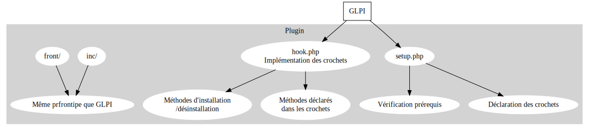

# Fonctionnement de GLPI

Le fonctionnement de GLPI est différent d'un logiciel à structure MVC, j'ai 
dressé ces diagrammes dans le but d'essayer de mieux comprendre le 
fonctionnement et présenter mon travail dans mon rapport de stage. Si vous 
n'avez jamais vu une structure similaire, cela peut aider le démarrage de la 
compréhension de la structure logicielle.

## GLPI

GLPI se compose de deux parties : 

* `front/` dans le premier, se trouve des fichiers gérant les requêtes
  utilisateurs qui ont pour but d'écrire en base de données, d'afficher des
  résultats, formulaires...

* `inc/` ce répertoire contient des classes correspondant aux objets traités 
  (appelés items dans la documentation développeur GLPI). Les méthodes de 
  ces classes permettent diverses actions sur ces items, notamment l'affichage
  (avec des echo de HTML, pas de moteur de template).
  
  Contrairement à ce que l'on peut penser, l'affichage (front-end donc) 
  n'est pas géré depuis le dossier front, mais bien inc. Cela peut porter à 
  confusion.

*Diagramme utilisé dans mon rapport de stage*

## Plugins

Le coeur d'un plugin est similaire au fonctionnement de GLPI avec les 
répertoires `front/` et `inc/`, mais diffère sur la connectivité à GLPI.

En effet comme décrit dans `modifier_glpi.md`, on peut utiliser des [crochets 
(hooks)](https://glpi-developer-documentation.readthedocs.io/en/master/plugins/hooks.html)
pour venir se greffer à GLPI. Ces crochets sont déclarés dans le `setup.php` 
et s'ils doivent appeler une fonction, sont nom est donné lors de la 
déclaration (donc dans `setup.php`) et est implémentée dans le scipt `hook.php`.

Aussi, ces deux fichiers doivent comporter un minimum de composants (fonction 
d'installation pour créer les table en DB, vérifier les prérequis...). 
["Requirements"](https://glpi-developer-documentation.readthedocs.io/en/master/plugins/requirements.html)

> Il me semble utile de noter que les namespaces php ne sont pas utilsés mais
> plutôt des conventions de nommage avec des noms de classes, parfois, à
> rallonge. Certains problèmes peuvent survenir si toutes les conditions ne 
> sont pas respectées, pour cela il convient de lire la documentation et de
> s'inspirer du travail déjà réalisé.

*Diagramme utilisé dans mon rapport de stage*
